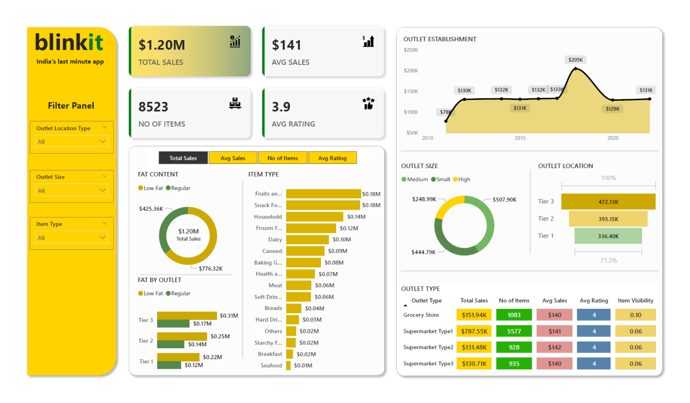

# Sales Performance Dashboard for Blinkit

## Dashboard Preview

## 1. Problem Definition

### Business Objective
Blinkit, a last-minute delivery app, required an intuitive solution to monitor sales performance and outlet effectiveness across various product categories and locations. The objective was to deliver a **comprehensive dashboard** that empowers stakeholders to make data-driven decisions swiftly.

### Key Performance Indicators (KPIs)
The following KPIs were identified to track sales trends and operational insights:
- **Total and Average Sales**
- **Number of Items Sold**
- **Customer Ratings**
- **Fat Content Sales Differentiation** (Low-fat vs. Regular)
- **Outlet Performance by Type, Size, and Location**

---

## 2. Data Collection

### Data Sources
Data was sourced from Blinkit’s internal systems, including:
- **Sales Transactions and Volumes** across various outlets.
- **Customer Feedback**: Ratings and item visibility metrics.
- **Outlet Attributes**: Location tier, size, establishment year, etc.

### Data Scope
The dataset covered:
- Multiple outlets and product categories.
- Historical records tracking performance over time.

---

## 3. Data Cleaning and Preprocessing

### Data Cleaning
Key steps taken to prepare the data:
- Addressed missing or incomplete entries, particularly in ratings and item visibility.
- Standardized **sales and transaction figures** to a consistent currency and unit.
- Harmonized categorical values (e.g., outlet types, item types).

### Data Transformation
Structured the raw data for Power BI analysis by:
- Aggregating **total and average sales** by outlet, item type, and location tier.
- Calculating derived metrics such as **average sales per item** and **average rating per outlet**.
- Segmenting data by **fat content** to analyze its impact on sales performance.

---

## 4. Exploratory Data Analysis (EDA)

### Summary Statistics and Distribution Analysis
- Sales distribution analysis revealed higher volumes in specific outlet types and locations.
- Identified high-performing item categories (e.g., snack foods and dairy) with the best sales and average ratings.

### Correlations and Trends
- Explored relationships between **outlet size and total sales**, uncovering a trend where larger outlets generated higher revenues.
- Tracked sales trends over time based on outlet establishment year, finding differences in performance between newer and older outlets.

---

## 5. Dashboard Design and Development

### Metric Visualization
Created an **interactive Power BI dashboard** with the following visualizations:
- **Total and Average Sales Metrics**: Prominently displayed to track overall performance.
- **Bar Charts**: Showed sales breakdown by fat content and item type.
- **Line Charts**: Illustrated sales trends over time based on outlet establishment year.
- **Filters**: Allowed users to drill down by outlet size, item type, and location tier.

### User Interactivity
- **Filter Panels**: Enabled dynamic exploration of data by outlet types and item visibility.
- **Slicers**: Provided filtering options for item type, outlet location, and outlet size for tailored analysis.

---

## 6. Insights and Recommendations

### Sales and Customer Preferences
- **High-Performing Categories**: Snack foods and dairy products were top sellers.
- **Location Insights**: Tier 1 locations generated higher average sales, suggesting potential focus areas for premium services.

### Outlet Performance by Type and Size
- **Supermarket Type 1 outlets** outperformed others, emphasizing their role as a key revenue driver. This insight can guide strategic decisions on **new outlet openings** or **renovations**.

### Customer Feedback and Ratings
- **Customer Ratings**: Average ratings remained consistent across outlets, reflecting steady satisfaction levels.
- **Improvement Opportunities**: Specific product categories with slightly lower ratings could be targeted for quality enhancement to boost overall customer experience.

---

## Conclusion
The **Blinkit Sales Performance Dashboard** successfully addresses the need for a data-driven approach to monitor and optimize sales and outlet performance. With its interactive design and actionable insights, it empowers stakeholders to make informed decisions and enhances the overall customer experience.
