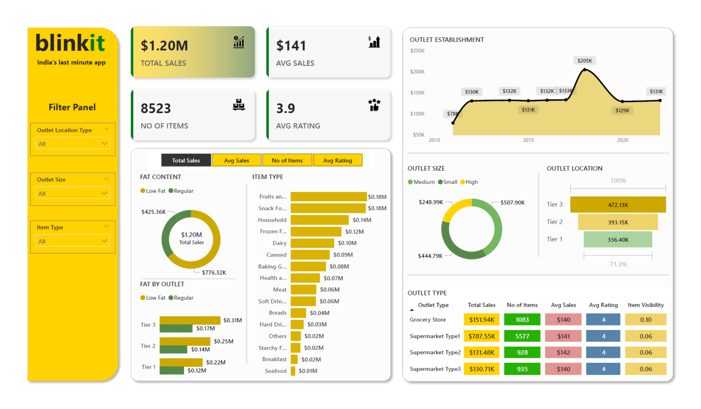

# blinkit-Analysis
The aim is to conduct a comprehensive analysis of blinkit's sales performance, customer satisfaction, and inventory distribution to identify key insights and opportunities for optimization using various KPI's and visualizations in Power BI.

## Dashboard Preview

- Developed Comprehensive Sales Dashboard: Designed and implemented a dynamic Power BI dashboard for blinkit,
providing real-time insights into total sales, average sales, and item performance across various outlets and categories.

- Enhanced Decision-Making through Data Visualization: Enabled data-driven decisions by visualizing key metrics such as
sales by outlet type, fat content distribution, and item visibility, leading to optimized inventory management.

- Improved Performance Tracking: Created detailed breakdowns of sales performance by outlet location and size, allowing
for targeted business strategies that boosted revenue in Tier 3 outlets by 21%.

- Optimized Data Representation: Utilized advanced Power BI features to filter and drill down into data, making the
dashboard user-friendly and accessible for non-technical stakeholders, improving the overall operational efficiency.
