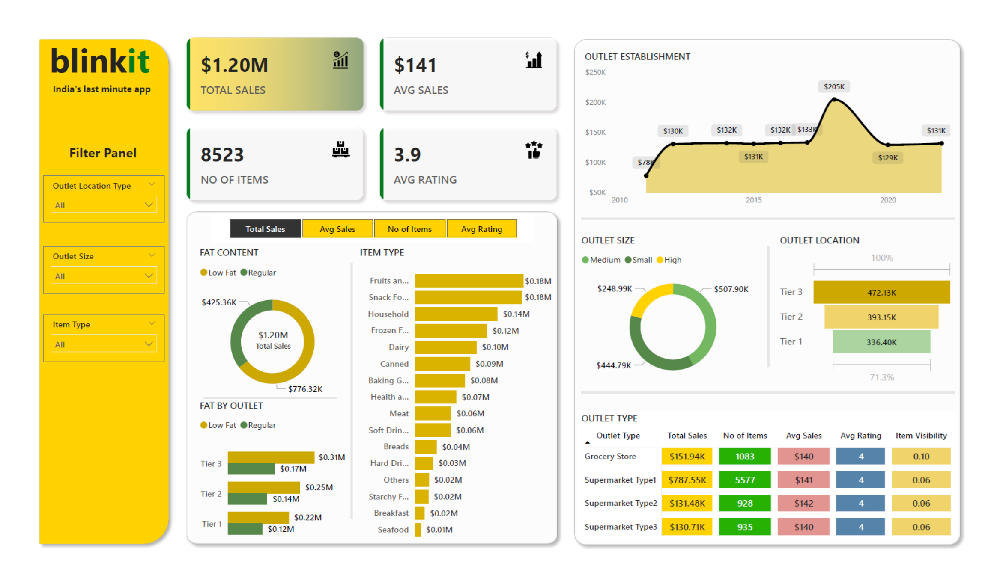

# 🛒 Blinkit Sales Analysis Dashboard | Power BI Project

## 📌 Project Overview

This project presents an end-to-end **Power BI Dashboard** built using Blinkit's grocery sales dataset. The dashboard provides actionable insights into sales performance, customer ratings, item distribution, outlet performance, and inventory trends through interactive visualizations and KPIs.

The objective is to transform raw business data into meaningful insights that support data-driven decision-making.

---

## 🎯 Business Problem

Blinkit generates large volumes of sales and product data across multiple outlets and item categories. Analyzing this data manually is challenging and time-consuming.

This dashboard helps stakeholders:

- Monitor overall sales performance
- Track customer satisfaction through ratings
- Analyze item-wise sales trends
- Compare outlet performance
- Identify high-performing product categories
- Make informed business decisions

---

## 📊 Dashboard Features

### Key Performance Indicators (KPIs)

- 💰 Total Sales
- 📈 Average Sales
- 🛍️ Number of Items Sold
- ⭐ Average Ratings

### Interactive Filters

Users can dynamically filter data by:

- Outlet Location Tier
- Outlet Size
- Item Type
- Fat Content
- Outlet Establishment Year

---

## 📈 Dashboard Insights

### Sales Analysis

- Total revenue generated across all outlets
- Sales distribution by item category
- Top-performing products

### Outlet Performance

- Sales by outlet location
- Sales by outlet size
- Sales by outlet type

### Customer Analysis

- Average customer ratings
- Product rating distribution

### Product Analysis

- Low Fat vs Regular products
- Item category contribution
- Inventory distribution across categories

---

## 🛠️ Tech Stack

| Tool | Purpose |
|--------|----------|
| Power BI | Dashboard Development |
| Power Query | Data Cleaning & Transformation |
| DAX | Calculated Measures & KPIs |
| Excel | Dataset Source |

---

## 📂 Project Structure

```text
Blinkit-Sales-Analysis/
│
├── Dataset/
│   └── BlinkIT_Grocery_Data.xlsx
│
├── Dashboard/
│   └── Blinkit_Dashboard.pbix
│
├── Images/
│   ├── Dashboard_Overview.png
│   ├── Sales_Analysis.png
│   └── Outlet_Analysis.png
│
└── README.md
```

---

## 🔄 Data Processing Workflow

1. Data Collection
2. Data Cleaning using Power Query
3. Data Transformation
4. Data Modeling
5. DAX Measure Creation
6. Dashboard Development
7. Insight Generation

---

## 📌 Key DAX Measures

### Total Sales

```DAX
Total Sales = SUM(Blinkit[Sales])
```

### Average Sales

```DAX
Average Sales = AVERAGE(Blinkit[Sales])
```

### Number of Items Sold

```DAX
Items Sold = COUNT(Blinkit[Item Identifier])
```

### Average Rating

```DAX
Average Rating = AVERAGE(Blinkit[Rating])
```

---

## 📷 Dashboard Preview

### Main Dashboard



---

## 🚀 How to Run

1. Download the repository

```bash
git clone https://github.com/yourusername/blinkit-sales-analysis.git
```

2. Open the `.pbix` file using Power BI Desktop.

3. Refresh the dataset if required.

4. Explore the interactive dashboard.

---

## 📊 Business Value

This dashboard enables:

- Faster decision-making
- Improved sales tracking
- Better inventory planning
- Outlet performance evaluation
- Customer satisfaction monitoring

---

## 🔮 Future Enhancements

- Sales Forecasting
- Customer Segmentation
- Product Recommendation Analysis
- Real-Time Data Integration
- Automated Reporting

---

## 👩‍💻 Author

**Meghana D A**

- MSc Data Science (Distinction)
- Data Scientist | Data Analyst
- Python | SQL | Power BI | Machine Learning

If you found this project helpful, please consider giving it a ⭐ on GitHub.
